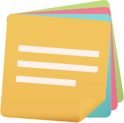

# Libello

A note-taking mobile application for pros (created using Flutter &amp; Firebase)

  
  
  
  
  
  

### References

- [Image by rawpixel.com on Freepik](https://www.freepik.com/free-vector/spiral-blue-notebook-mockup-isolated-vector_3439801.htm#query=notebook&position=31&from_view=search&track=sph#position=31&query=notebook)
- [Loading animation from Lottie](https://lottiefiles.com/110457-notes-document)
- [Design from Dribbble](https://dribbble.com/shots/19851196-Notes-Pro-mobile-app)

